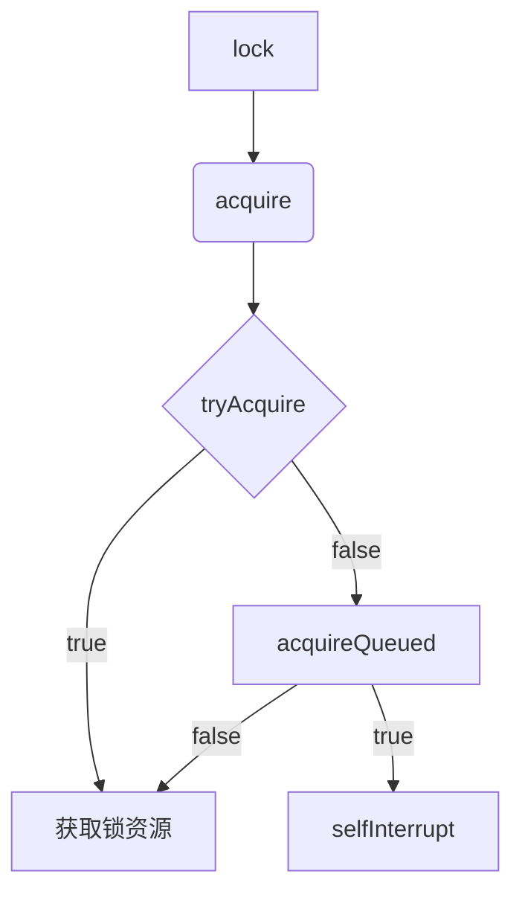
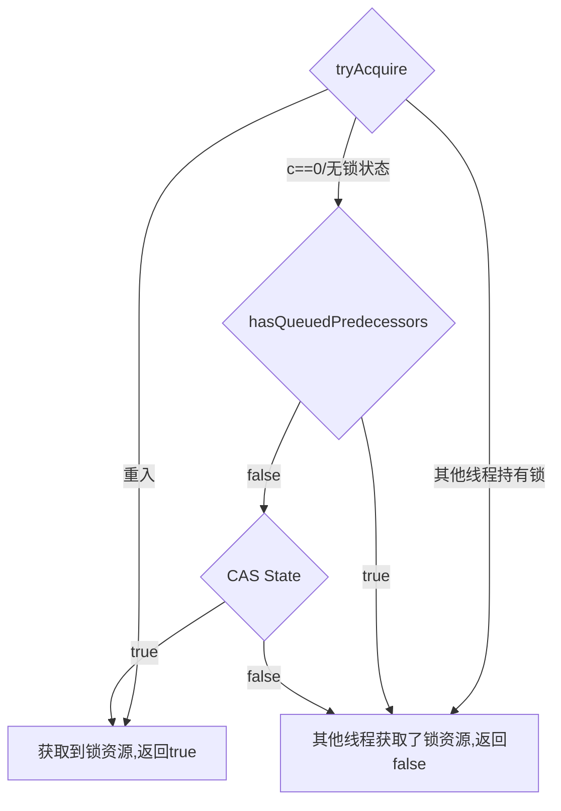

### Java 并发包源码笔记——AbstractQueuedSynchronizer的实现之ReentrantLock

#### 一、前言

> 1.该系列源码jdk版本为：**1.8.0_171-b11**
>
> 2.如有疏漏之处还请指出

#### 二、`ReentrantLock`怎么用？

##### 1.`ReentrantLock`常用方法


从上图我们可以看到`ReentrantLock`提供了三个加锁的方法，且都是实现了`Lock`接口得到的，分别是：

> lock：一直阻塞直到获取锁

> lockInterruptibly：调用后一直阻塞到获取锁，直到收到中断信号

> tryLock：尝试能否获取锁，如果不能就返回


##### 2.如何使用

> ReentrantLock使用起来非常简单，因为内部的细节全都被隐藏起来了，我们只需要简单的调用lock、unlock方法即可达到加锁和释放锁的目的

```java
public class ReentrantLockTry{
    public static void main(String[] args){
        //默认是非公平锁的实现
        Lock lock = new ReentrantLock();
        //开始加锁
        lock.lock();
        try{
            //业务代码
        }catch(Exception e){
            
        }finally{
            //释放锁，千万不要忘记
            lock.unlock();
        }
    }
}
```

#### 三、`ReentrantLock`加锁原理

##### 1.`ReentrantLock`的内部结构

博主看书喜欢先看目录，因为从目录就可以看出来一本书讲的都是什么东西，所以看源码的时候也喜欢先从继承体系、类的结构开始看起，因为这样更能从整体上把握这块知识。所以我们可以先看看`ReentrantLock`的内部结构


从上图我们可以看到`ReentrantLock`中有三个内部类，分别为`Sync`、`FairSync`、`NonfairSync`，其中`FairSync`和`NonfairSync`是抽象类Sync的实现。

这里需要介绍一下公平锁和非公平锁的基本概念：

> 公平锁：每个线程抢占锁的顺序为lock方法调用顺序(即有先来后到的顺序)
>
> 非公平锁：每个线程抢占锁的顺序完全随机，谁运气好谁先抢到(即来得早不如来得巧)

在`ReentrantLock`中，`FairSync`即为公平锁，`NonfairSync`即为非公平锁，在`ReentrantLock`中，如果我们不选择则默认使用非公平锁，这是因为非公平锁在大多数情况下有更高的吞吐量。

```java
public class ReentrantLock implements Lock,Serializable{
    
    private final Sync sync;
    
    //默认构造器实现非公平锁
    public ReentrantLock() {
        sync = new NonfairSync();
    }

    public ReentrantLock(boolean fair) {
        sync = fair ? new FairSync() : new NonfairSync();
    }
}
```

##### 2.`Sync`的实现

从上文分析我们知道了`Sync`有两个实现，一个是`FairSync`、一个是`NonfairSync`，这里挑选`FairSync`来看看具体实现(相对于`NonfairSync`稍微复杂一点)。

###### 2.1 `FairSync`的继承体系


在这里，最重要的部分就是`AbstractQueuedSynchronizer`(简称AQS)，几乎所有加锁和释放锁的细节都隐藏在在`AQS`中。

###### 2.2 `AQS`内部结构

`AQS`内部结构如下所示：


从上图我们可以看到`AQS`中的属性和内部类中的属性，这里简单介绍一下：

```java
//头节点，也即当前持有锁的节点
private transient volatile Node head;

//阻塞队列的尾节点
private transient volatile Node tail;

//当前锁的状态，0代表没有被占用，大于0代表有线程持有当前锁(重入时，大于1)
private volatile int state;
```

`AQS`通过一个名为`CLH`的阻塞队列(***其实就是Node组成的双向链表***)保存等待的线程的，值得注意的是***在阻塞队列中并不包含head节点***，阻塞队列结构如下所示：


Node是一个双向链表，在Node中有几个属性需要提前知道一下

```java
		
//共享模式
static final Node SHARED = new Node();
        
//独占模式
static final Node EXCLUSIVE = null;

//取消状态
static final int CANCELLED =  1;
        
static final int SIGNAL    = -1;
 
static final int CONDITION = -2;
        
static final int PROPAGATE = -3;

//取值为上面的 1、-1、-2、-3或者0
volatile int waitStatus;

//前驱节点
volatile Node prev;

//后驱节点
volatile Node next;

//当前线程
volatile Thread thread;

//condition相关
Node nextWaiter;
```

###### 2.3 `lock`加锁原理

`ReentrantLock`加锁的大致流程如下所示：



我们从`acquire`方法开始分析加锁流程，前面`lock`方法直接调用`acquire`方法的过程就略去了

```java
//AQS中，arg=1
public final void acquire(int arg) {
    //先尝试获取锁资源
        if (!tryAcquire(arg) &&
            //获取不到锁资源即加入到阻塞队列中
            acquireQueued(addWaiter(Node.EXCLUSIVE), arg))
            selfInterrupt();
}
```

`acquire`方法逻辑简单且清晰，`if`判断中有两个条件，如果`tryAcquire`返回`true`则`if`判断中肯定为`false`，那么当前逻辑直接跳出。

```java
//ReentrantLock
protected final boolean tryAcquire(int acquires) {
            final Thread current = Thread.currentThread();
            int c = getState();
            if (c == 0) {//无锁
                if (!hasQueuedPredecessors() &&
                    compareAndSetState(0, acquires)) {
                    setExclusiveOwnerThread(current);
                    return true;
                }
            }
            else if (current == getExclusiveOwnerThread()) {
                //自旋锁
                int nextc = c + acquires;
                if (nextc < 0)
                    throw new Error("Maximum lock count exceeded");
                setState(nextc);
                return true;
            }
            return false;
        }
```

`tryAcquire`方法中有3个分支：

> 当前处于无锁状态：判断队列中是否有线程在等待，如果有则返回，否则CAS操作改变state状态
>
> 当前处于重入状态：state自增
>
> 别的线程持有锁状态：返回。。。



从上面的分析我们知道，当`tryAcquire`返回true的时候，当前线程可以获得锁资源，但是当其返回false的时候我们需要把需要获取锁的线程加入到阻塞队列中等待，即`acquireQueued`，`acquireQueued`方法需要传两个参数，一个是需要加入阻塞队列中等待的Node，另一个是`acquire`参数，在分析`acquireQueued`方法之前，我们需要分析一下`addWaiter`方法

```java
public final void acquire(int arg) {
        if (!tryAcquire(arg) &&
            acquireQueued(addWaiter(Node.EXCLUSIVE), arg))
            selfInterrupt();
}

private Node addWaiter(Node mode) {
    	//构造node节点
        Node node = new Node(Thread.currentThread(), mode);
        Node pred = tail;
    	//队列非空，不需要初始化
        if (pred != null) {
            //让原队列中的尾节点变成node节点的前驱节点
            node.prev = pred;
            //CAS操作，把node放到队列的尾部
            if (compareAndSetTail(pred, node)) {
                //把队列的尾节点设置为node，至此双向链表成型
                pred.next = node;
                return node;
            }
        }
    	//队列为空或者CAS操作把node设置为tail失败会走到此处
        enq(node);
        return node;
}
```

在`addWaiter`过程中，先构造一个Node节点，如果队列非空，直接把该节点加入到队列中的尾部，否则死循环入列

```java
private Node enq(final Node node) {
    	//死循环，直到node入列为止
        for (;;) {
            Node t = tail;
            //因为tail(也即队列尾部)为空，所以可知队列为null
            if (t == null) { // Must initialize
                //CAS初始化队列头部
                if (compareAndSetHead(new Node()))
                    //队列中只有一个元素，所以头部等于尾部
                    //此时死循环并未中断，而是在下次调入else分支
                    tail = head;
            } else {
                //队列非空，把node的前驱节点置为之前队列的尾部
                node.prev = t;
                //CAS设置队列的尾部
                if (compareAndSetTail(t, node)) {
                    //把队列的尾部设置为node
                    t.next = node;
                    return t;
                }
            }
        }
}
```

至此，当前线程已经入列，`acquireQueued`方法中做了什么处理：

```java
final boolean acquireQueued(final Node node, int arg) {
    	//失败标识
        boolean failed = true;
        try {
            //中断标识
            boolean interrupted = false;
            for (;;) {
                //获取前驱节点
                final Node p = node.predecessor();
                //如果前驱节点是头节点并且获取到了锁资源
                if (p == head && tryAcquire(arg)) {
                    //设置node为头节点
                    setHead(node);
                    //此时可以知道队列中只有头节点，所以next直接置为null
                    p.next = null; // help GC
                    //失败标识置为false
                    failed = false;
                    return interrupted;
                }
                //根据前驱节点的状态来操作node
                if (shouldParkAfterFailedAcquire(p, node) &&
                    //挂起线程
                    parkAndCheckInterrupt())
                    interrupted = true;
            }
        } finally {
            if (failed)
                cancelAcquire(node);
        }
}
```

在`acquireQueued`方法中，如果前驱节点是头节点，并且获取到了锁资源，则直接返回了，如果前驱节点不是头节点，则需要判断前驱节点状态，根据前驱节点的状态来做操作：

```java
private static boolean shouldParkAfterFailedAcquire(Node pred, Node node) {
        int ws = pred.waitStatus;
    	//因为挂起和唤醒操作都是通过前驱节点进行的，所以要判断前驱节点状态
    	//当前驱节点状态为SIGNAL即-1，则为正常状态
        if (ws == Node.SIGNAL)
            return true;
        if (ws > 0) {
            //如果大于0，则说明前驱节点取消了排队
            //则需要把node的前驱节点递归向前找，一直到前驱节点为-1
            do {
                node.prev = pred = pred.prev;
            } while (pred.waitStatus > 0);
            pred.next = node;
        } else {
            //该情况下，ws为0，所以直接置为-1
            compareAndSetWaitStatus(pred, ws, Node.SIGNAL);
        }
        return false;
    }
```

从上我们可以看到如果`shouldParkAfterFailedAcquire`返回为false，则进入下一轮循环，如果返回true，则为正常状态，需要挂起当前线程：

```java
private final boolean parkAndCheckInterrupt() {
        LockSupport.park(this);
        return Thread.interrupted();
}
```

###### 2.6 释放锁

从上文可以知道，我们通过调用lock方法加锁，通过unlock方法解锁，接下来我们看一看当线程执行完是如何释放锁资源的

```java
public void unlock() {
    	//通过调用AQS中的release方法
        sync.release(1);
}
```

在`release`方法中，和`lock`相似，先通过`tryRelease`方法尝试释放锁资源

```java
public final boolean release(int arg) {
    	//tryRelease方法来自ReentrantLock中
        if (tryRelease(arg)) {
            Node h = head;
            //如果头节点不为空，且状态为无锁状态，唤醒线程
            if (h != null && h.waitStatus != 0)
                unparkSuccessor(h);
            return true;
        }
        return false;
}
```

我们回到`ReentrantLock`类中的`tryRelease`方法

```java
protected final boolean tryRelease(int releases) {
    		//获取状态
            int c = getState() - releases;
    		//判断当前线程是否是持有锁的线程
            if (Thread.currentThread() != getExclusiveOwnerThread())
                throw new IllegalMonitorStateException();
            boolean free = false;
    		//c==0代表，即将释放锁
    		//c不等于0说明getstate()获取的值大于1，说明之前锁重入了
            if (c == 0) {
                free = true;
                //清空占有锁的线程标识
                setExclusiveOwnerThread(null);
            }
    		//设置state状态
            setState(c);
    		//在没有重入锁的状态，此处应该返回true，即unlock成功
            return free;
}
```

当`tryRelease`返回`true`时，我们继续看接下来程序逻辑

```java
//用来唤醒后继节点
private void unparkSuccessor(Node node) {
        int ws = node.waitStatus;
    	//把小于0的状态置为0
    	//The field is initialized to 0 for normal sync nodes
        if (ws < 0)
            compareAndSetWaitStatus(node, ws, 0);
        Node s = node.next;
    	//waitStatus>0代表取消等待了
    	//此处是从链表尾节点依次向前找，找到最前面的一个waitStatus<=0的节点
    	//从后往前找而不是从前往后找的原因在于node入列的时候先设置head
    	//之后才通过CAS操作设置tail，这样有可能CAS是失败的
    	//所以从后往前找不会出错
        if (s == null || s.waitStatus > 0) {
            s = null;
            for (Node t = tail; t != null && t != node; t = t.prev)
                if (t.waitStatus <= 0)
                    s = t;
        }
        if (s != null)
            //唤醒操作
            LockSupport.unpark(s.thread);
    }
```

至此，锁资源的释放结束，代表着一个加锁过程的最终完结。

###### 2.5 总结

> ReentrantLock通过AQS来处理加锁细节
>
> 多线程情况下通过Node构造的链表(也称为阻塞队列)保存等待中的线程

#### 四、参考资料

##### 1.[HongJie大神的博客](https://javadoop.com/post/AbstractQueuedSynchronizer)

##### 2.jdk源码


